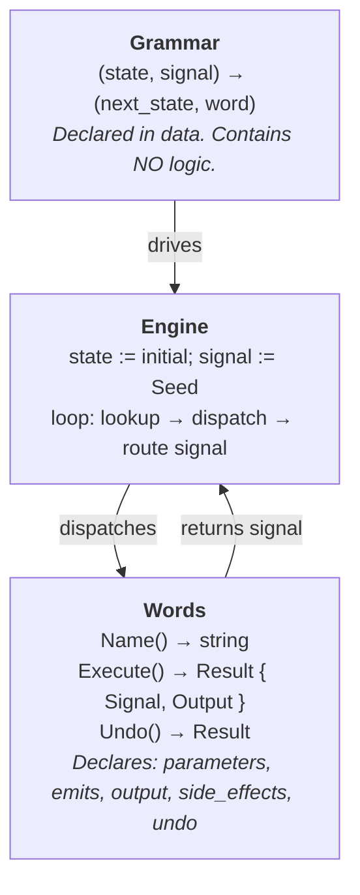
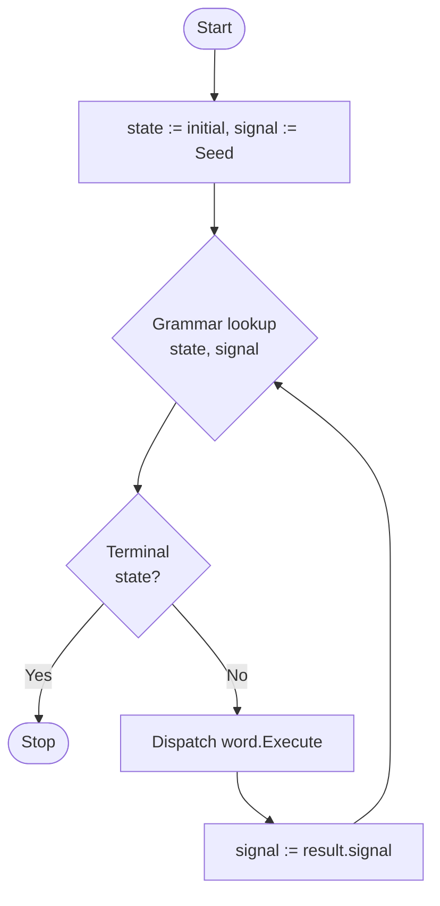
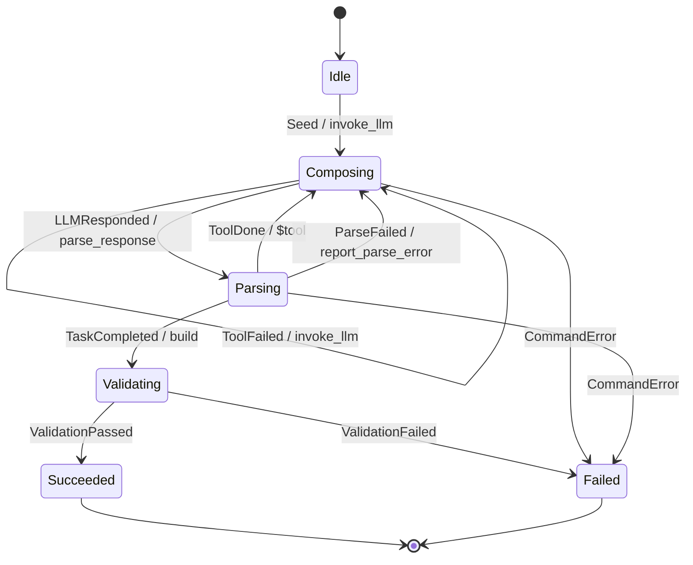
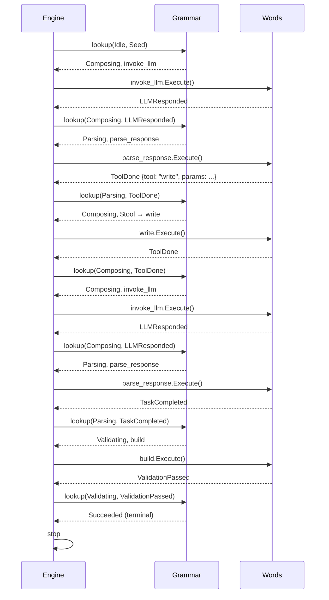

# The Grammar Machine Pattern

*A compound design pattern for declarative workflow composition where a state
machine acts as a grammar, tools act as words, and executions are sentences.*

---

## Intent

Separate **what to do** (tools) from **when to do it** (grammar) so that
complex, multi-step workflows can be declared, validated, composed, reversed,
and audited without modifying execution logic.

## Also known as

- Tools-as-DSL
- Action Grammar
- Declarative Workflow Composition
- State Machine Orchestrated Command Pattern

## Motivation

Consider a system that must orchestrate an LLM to write code: invoke the
model, parse its response, dispatch a tool call, feed the result back, and
eventually validate the output. The naive approach is an imperative loop with
conditionals -- "if the LLM responded, parse it; if parsing succeeded and it's
a tool call, dispatch it; if the tool failed, retry..." This logic is opaque,
hard to test, impossible to validate statically, and cannot be reversed.

The Grammar Machine pattern separates this into two orthogonal concerns:

1. **Words** -- atomic, self-contained operations (invoke LLM, parse response,
   write file, run tests). Each word declares its inputs, its possible
   outcomes (signals), and its side effects. A word contains all the logic
   for one operation. It knows nothing about what comes before or after it.

2. **Grammar** -- a declarative transition table that says "in state S, after
   signal G, move to state T and execute word W." The grammar contains no
   logic. It is a data structure -- a table, a graph, a YAML file -- that
   defines which sequences of words are legal.

An **execution** is a sentence: a path through the grammar, composed of words
connected by signals. The grammar constrains which sentences are expressible.
The words produce the signals that drive the grammar forward.

This separation yields properties that an imperative loop cannot provide:
static validation of the grammar against the word lexicon, reversibility by
walking the sentence backward, serializability of the execution state, and
composability of grammars from shared word vocabularies.

## Applicability

Use the Grammar Machine pattern when:

- The workflow involves a sequence of discrete operations with branching
  based on outcomes.
- The operations are reusable across different workflows (the same "write
  file" word appears in code generation, migration, and scaffolding
  grammars).
- You need to validate the workflow before executing it (prove that every
  signal every word can emit is handled by the grammar).
- You need to reverse, replay, or audit executions.
- You need to suspend execution and resume it later (across process
  boundaries).
- Different actors compose workflows: some deterministic (the grammar
  author), some adaptive (an LLM choosing words at runtime).

## Structure



### Participants

**Word** (Command, Tool, Action)
: An operation that accepts parameters, produces a result with a signal, and
  optionally mutates state. Declares its type signature: what it accepts, what
  signals it can emit, what it outputs, and what side effects it has.
  Implements `Execute` and `Undo`. A word may be **terminal** (an atomic
  verb like `write` or `build`) or **non-terminal** (a boundary verb whose
  `Execute` runs an entire sub-grammar, producing a full sentence inside
  what the parent grammar sees as a single word). From the parent grammar's
  perspective, a non-terminal word is still one word with declared signals --
  it just happens to expand into a sentence internally.

**Signal** (Event, Outcome)
: A value produced by a word that carries the outcome of its execution back
  to the grammar. Signals are the connective tissue between words. They are
  not arbitrary -- each word declares the finite set of signals it can emit.

**State** (Phase, Mode)
: A named position in the grammar. States have no behavior. They exist only
  as lookup keys in the transition table.

**Grammar** (Machine, Transition Table)
: A pure data structure mapping `(state, signal)` pairs to
  `(next_state, word)` pairs. Contains no logic, no conditionals, no loops.
  Fully declarative. Can be stored as YAML, JSON, a database table, or a
  compile-time constant.

**Lexicon** (Registry, Vocabulary)
: The set of all available words. The grammar references words by name; the
  lexicon resolves names to executable implementations. The grammar is
  validated against the lexicon at load time.

**Engine** (Loop, Interpreter, Runtime)
: The fixed, generic loop that drives execution. It performs the lookup, the
  dispatch, and the signal routing. The engine never changes -- different
  behaviors come from different grammars and different lexicons, not from
  modifying the engine.

**Sentence** (Execution, Trace, Run)
: A path through the grammar: a sequence of `(state, signal, word, result)`
  tuples produced by one execution. The sentence is the artifact of a run.
  It can be recorded, replayed, reversed, and audited.

**Builder** (Factory)
: Constructs a word instance from the previous word's result. Bridges the
  output of one word to the input of the next. The grammar selects the
  builder; the builder constructs the word.

## Collaborations



1. The engine starts in the grammar's initial state with a seed signal.
2. The engine looks up `(state, signal)` in the grammar to find
   `(next_state, word)`.
3. If `next_state` is terminal, the engine stops.
4. Otherwise, the engine dispatches the word via `Execute`.
5. The word performs its operation and returns a result with a signal.
6. The engine feeds the new signal back to step 2.

The word never knows what state the grammar is in. The grammar never knows
what the word does internally. The engine is the only participant that
touches both, and it does so generically -- it works with any grammar and
any lexicon without modification.

## Consequences

### Benefits

**Static validation.** The grammar can be checked before execution: every
state-signal pair referenced in transitions must exist; every word name must
resolve in the lexicon; every signal a word declares in `emits` must be
handled by the grammar in every state where that word can be dispatched.
This eliminates a class of runtime errors.

**Auditable execution.** The sentence is a complete, structured record of
what happened. Each entry names the word, the state transition, and the
signal. This is inherently traceable -- you can reconstruct the execution
path from the sentence without re-running anything.

**Reversibility.** Because every word has `Undo` and the sentence records
the execution order, the engine can walk the sentence backward, calling
`Undo` on each word in reverse. Combined with environment checkpointing,
this gives full rollback.

**Serializability.** The grammar is data. The sentence is data. The engine's
position (current state + last signal) is two strings. This means the
execution can be serialized, persisted, and resumed in a different process.

**Composability.** Different grammars can share the same lexicon. A code
generation grammar and an evaluation grammar reuse the same `build`, `test`,
and `write` words. New workflows are new grammars, not new code. Grammars
compose hierarchically: a word in one grammar can expand into a full sentence
in another grammar, giving recursive depth without recursive complexity in
any single grammar.

**Dual authorship.** The grammar can be authored by a human (deterministic
workflow) or by an LLM (adaptive composition). The `$tool` dispatch slot
lets the LLM choose words at runtime, but the grammar still constrains
which signals are handled afterward. The LLM speaks the language; the
grammar enforces its syntax.

### Liabilities

**Indirection.** Understanding a workflow requires reading the grammar and
the word implementations separately. The execution path is not visible in
any single file.

**Signal explosion.** As words grow more nuanced, the number of signals
increases, and the grammar must handle every combination. This can make
large grammars verbose.

**Data flow is implicit.** The grammar declares control flow (what word
runs next) but not data flow (what data moves between words). Data passes
through the result/output channel, but the grammar doesn't type-check it.

## Relationship to known patterns

The Grammar Machine is a compound pattern built from several GoF and
post-GoF patterns:

**Command** (GoF). Each word is a Command: an object that encapsulates a
request with `Execute` and `Undo`. The Grammar Machine adds declarative
dispatch -- commands are selected by a data-driven lookup table rather than
by imperative code.

**State** (GoF). The grammar is a State Machine, but inverted: instead of
states containing behavior (the GoF State pattern), states are inert labels
and behavior lives in words dispatched by transitions. The grammar is data,
not a class hierarchy.

**Interpreter** (GoF). The grammar is a language definition; the engine is
an interpreter that evaluates sentences in that language. But where the GoF
Interpreter pattern uses a class hierarchy to represent the grammar, the
Grammar Machine uses a flat transition table. And where Interpreter
evaluates expressions, the Grammar Machine executes side-effectful commands.

**Strategy** (GoF). Words are interchangeable strategies selected at
runtime. The grammar acts as the strategy selector, choosing which word to
dispatch based on the current state and signal.

**Memento** (GoF). The sentence (execution recording) serves as a memento
that captures enough state to reverse or replay the execution.

**Functional Core, Imperative Shell** (Bernhardt, 2012). The grammar is
the functional core -- a pure, deterministic, testable function from
`(state, signal)` to `(state, word)`. The words are the imperative shell --
they perform I/O, call APIs, mutate files. The engine mediates between them.

**Harel Statecharts** (Harel, 1987). The Grammar Machine uses flat state
machines, but exhibits hierarchical composition through non-terminal words:
a word in one grammar can be an engine running a sub-grammar, exactly as a
Harel superstate expands into a child chart. The parent grammar sees one
word and one signal; the child grammar produces a full sentence internally.

**Action Language** (Bultan & Yavuz-Kahveci, 2000). A formal specification
language for model-checking state machine specifications. The Grammar
Machine's declarative transition table is an informal variant of an action
language, amenable to the same kinds of static analysis.

**Action Grammar** (Tasker, 2025). Composable `action(resource)` primitives
with declared input/output contracts, validated at assembly time. The
Grammar Machine's word declarations (parameters, emits, output, side
effects) serve the same role as action grammar type signatures.

## Implementation notes

### The grammar is data, not code

The grammar must be representable as a data structure that can be loaded,
serialized, transmitted, and validated without executing any code. YAML,
JSON, a database table, or a compile-time constant are all valid
representations. If the grammar requires code to express, it has absorbed
logic that belongs in words.

### Words are configured, not coded

A word implementation is a generic interpreter. Its tool declaration (YAML)
is the program it interprets. The same Go code that serves one agent's web
UI can serve another's dashboard by loading a different configuration. The
same shell executor runs `build`, `test`, or `lint` depending on which
command string its YAML provides.

This principle applies at every level:

- **Engine** interprets **grammar** (machine.yaml)
- **Grammar** dispatches **words** (transition table)
- **Words** interpret their **configuration** (tool declaration YAML)
- **Boundary words** interpret their **actor configuration** (LLM config,
  UI config, harness config)

The compiled code provides **capability** — the generic ability to serve
HTTP, invoke an LLM, execute a shell command, manage files. Configuration
provides **specificity** — what to serve, which model, what command, which
files. One binary serves N agents. One word implementation serves M tools.
The combinatorial space lives in configuration, not code.

A well-designed word implementation should never be specific to a single
agent. If it is, the agent-specific knowledge belongs in configuration, not
in the word's source code. The test is: "can I use this same Go code for a
different agent by changing only YAML?" If not, the word has absorbed policy
that belongs in its declaration.

### Words are opaque to the grammar

A word's internal implementation is invisible to the grammar. The grammar
knows only the word's name and the signals it can emit. This means:

- Words can be replaced without changing the grammar (swap a mock word
  for a real one in tests).
- Words can be implemented in different languages or run in different
  processes (the engine communicates via the `Execute`/`Result` interface).
- Words can be reused across grammars without modification.

### Signals are a closed vocabulary

Each word declares the finite set of signals it can emit. The grammar is
validated against this vocabulary: for every state where a word can be
dispatched, the grammar must handle every signal that word can emit. An
unhandled signal is a grammar error, detectable at load time.

### The engine is fixed

The engine loop is identical for all workflows. It never contains
domain-specific logic. Different behaviors come from different grammars
and different lexicons. If you find yourself adding conditionals to the
engine, the logic belongs in a word or in the grammar.

### Dynamic dispatch is a grammar feature, not an engine feature

When an LLM or external actor chooses the word at runtime (the `$tool`
slot), this is a transition in the grammar where the word name is resolved
dynamically. The grammar still defines which signals are handled after the
dynamically-chosen word executes. The grammar constrains the LLM's choices
without knowing them in advance.

### Words can expand into sentences (recursive composition)

A word in the grammar is not necessarily atomic. A **non-terminal word** (a
boundary verb) runs an entire sub-grammar inside its `Execute`. From the
parent grammar's perspective it is still a single word -- one dispatch, one
returned signal. But internally it spins up an engine, loads a child
grammar, and produces a full sentence.

This is how agents compose: the evaluator grammar has a `run_agent` word.
That word starts a child engine running the generator grammar. The generator
produces a complete sentence (invoke LLM, parse, dispatch tools, validate).
When it finishes, the evaluator receives a single signal (`PointDone`) and
advances to its next state. The evaluator's sentence reads `... → run_agent
→ ...` while the generator's sentence reads `invoke_llm → parse_response →
write → invoke_llm → ... → build → test`.

```
Evaluator sentence:
  ... → dump_config → run_agent → run_oracle_check → ...
                        │
                        └─ expands to Generator sentence:
                             invoke_llm → parse_response → write →
                             invoke_llm → parse_response → done →
                             build → lint → test
```

This gives the pattern recursive depth without recursive complexity in any
single grammar. Each grammar stays flat and independently validatable. The
hierarchical structure emerges from composition, not from nesting within a
single grammar definition. The formal analogy is to non-terminal symbols in
a context-free grammar: the parent grammar treats the word as a token, but
it expands into a derivation in the child grammar.

Rollback and auditing compose the same way: the child sentence is recorded
inside the parent sentence entry. Undoing the parent word means undoing the
child sentence. The parent engine calls `Undo` on the boundary word, which
walks the child sentence backward.

### Boundary words and actor types

A boundary word crosses from the grammar's deterministic domain into an
external actor. The grammar is indifferent to what kind of actor lives on
the other side — it sees one word, one signal back. But the word's
configuration determines how it interfaces with that actor.

Three actor types:

| Actor type | Example word | Configuration | "Prompt" equivalent |
|---|---|---|---|
| Model | `invoke_llm` | `llm/*.yaml` (model, profile, temperature) | System prompt + tool manifest |
| Human | `serve_ui` | UI config (assets, routes, action map) | The interface presented |
| Agent | `run_agent` | Harness config (binary, flags, machine) | The child grammar + tools |

In each case, the actor configuration is how you shape what the external
actor sees and what responses it can give. For a model, that's the prompt.
For a human, that's the UI. For a child agent, that's its grammar and
lexicon. All three are YAML-configured, not compiled. The same Go
implementation serves different actors by loading different configuration.

### Undo is a word-level concern

Every word implements `Undo`, even if it's a no-op. The engine doesn't
know how to reverse a word's effects -- only the word itself knows. The
engine's role in rollback is to walk the sentence backward and call `Undo`
on each word in order. The word decides what undoing means for its specific
operation.

### Side effect declarations enable automated reasoning

When words declare their side effects (filesystem write, state mutation,
network call), the engine or a static analyzer can reason about them
without executing anything: which words need environment checkpointing,
which words are read-only and can be skipped during rollback, which words
conflict with each other.

## Known uses

- **Donna** (Tiendil, 2025): Markdown-defined workflows compiled into FSMs
  for coding agents. Operations are words; goto directives define the
  grammar; the runtime validates reachability before execution.

- **Skflow** (skill-flow, 2025): Compiles markdown agent skills into
  TypeScript state machines. Deterministic steps (`sh`) run automatically;
  the script yields to the LLM (`ask`) only for judgment calls.

- **LLM-nano-vm** (2025): A lightweight virtual machine where the LLM acts
  as a decision-maker within a program DSL. Step types (`llm`, `tool`,
  `condition`, `parallel`) are the words; the program structure is the
  grammar.

- **Jido Composer** (2025): Elixir framework with five composition
  primitives (sequence, parallel, choice, traverse, identity) as the
  grammar constructors. Workflows are compile-time compositions;
  orchestrators are runtime compositions where the LLM selects tools.

- **Tasker Action Grammars** (2025): Rust-native `action(resource)`
  primitives with compile-time enforced data contracts. The grammar
  validates handler compositions structurally before execution.

- **Lean4Agent** (2025): Formal verification of agent workflows using
  dependent type theory. Structural well-formedness (grammar validation),
  semantic soundness (pre/post-conditions on words), and trajectory
  analysis (sentence verification) as three verification layers.

## Related patterns

- **Saga Pattern** (Garcia-Molina & Salem, 1987): A sequence of
  transactions where each has a compensating action. The Grammar Machine
  generalizes this: the sentence is the saga, words are transactions,
  `Undo` methods are compensating actions, and the grammar defines the
  ordering.

- **Workflow Engine** (van der Aalst, 1998): BPMN and similar workflow
  engines use directed graphs to orchestrate activities. The Grammar Machine
  replaces the graph with a transition table and uses signals instead of
  explicit edges, gaining static validation and reversibility.

- **Blackboard Pattern** (GoF-adjacent): Multiple specialists contribute
  to a shared state. In the Grammar Machine, the shared state is the
  result chain, and the grammar (not an opportunistic controller) decides
  which specialist runs next.

## Sample grammar

A code generation grammar expressed as a state diagram:



The same grammar in YAML:

```yaml
name: generator
initial_state: Idle

states: [Idle, Composing, Parsing, Validating, Succeeded, Failed]
terminal_states: [Succeeded, Failed]
signals: [Seed, LLMResponded, ToolDone, ToolFailed, EditDone,
          ParseFailed, TaskCompleted, ValidationPassed,
          ValidationFailed, CommandError]

transitions:
  - {state: Idle,       signal: Seed,             next: Composing,  action: invoke_llm}
  - {state: Composing,  signal: LLMResponded,     next: Parsing,    action: parse_response}
  - {state: Parsing,    signal: ToolDone,         next: Composing,  action: $tool}
  - {state: Parsing,    signal: TaskCompleted,    next: Validating,  action: build}
  - {state: Parsing,    signal: ParseFailed,      next: Composing,  action: report_parse_error}
  - {state: Composing,  signal: ToolDone,         next: Composing,  action: invoke_llm}
  - {state: Composing,  signal: EditDone,         next: Composing,  action: nudge_reread}
  - {state: Composing,  signal: ToolFailed,       next: Composing,  action: invoke_llm}
  - {state: Validating, signal: ValidationPassed, next: Succeeded}
  - {state: Validating, signal: ValidationFailed, next: Failed}
  - {state: Composing,  signal: CommandError,     next: Failed}
  - {state: Parsing,    signal: CommandError,     next: Failed}
```

Read as a grammar: "From Idle, seed invokes the LLM. The LLM's response is
parsed. If parsing yields a tool call, dispatch it dynamically and feed the
result back to the LLM. If the model says it's done, validate. If validation
passes, succeed." Every legal execution of this grammar is a sentence in the
language it defines.

A sample sentence (execution trace) through this grammar:


