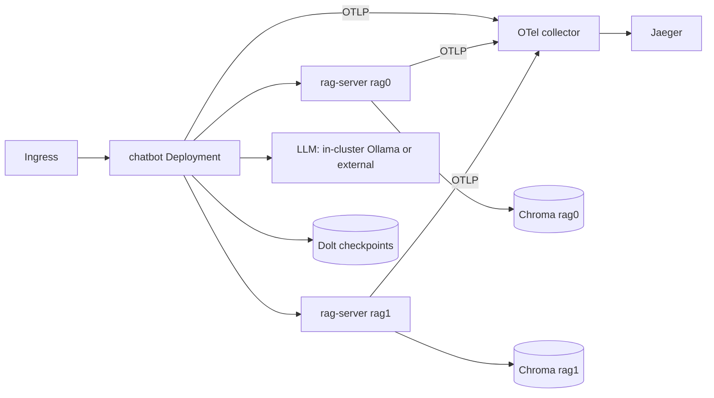

# chatbot-mesh

A Helm chart that deploys the declarative-agents chatbot mesh on Kubernetes: the browser-facing chatbot agent, a values-driven list of RAG units (each a rag-server agent paired with its own Chroma database), a chat/embedding LLM, a Dolt checkpoint backend, and an OTel collector feeding a Jaeger trace backend.

## Architectural thesis

One runtime image serves every agent role. Each agent's program is a profile supplied from a ConfigMap and mounted at `/profiles`, not baked into the image, so the same image runs the chatbot and every rag-server and a values change re-renders the topology without rebuilding images (the rel06.0 mounted-profile contract, srd034). The RAG topology is one values list: each entry renders a rag-server Deployment/Service and a Chroma StatefulSet/Service, and (srd015 R2, co-generation in GH-314) the chatbot's RAG client entries, so the deployed topology and the chatbot's client configuration cannot drift.

## Topology



## Scope and status

This chart (GH-313) is the deployment topology: chatbot, N RAG units from `ragUnits`, LLM, Dolt, collector, and Jaeger, with ingress and internal Services, over the rel06.0 image with ConfigMap-mounted profiles (srd015 R1, R5). The `helm template`/`helm lint` render is verified. Values-to-config co-generation of the chatbot `rest.yaml` and the checkpoint-resume warm swap (srd015 R2, R3) land in GH-314; the provisioning panel (R4) in GH-315; the kind smoke test in its own issue.

## Repository structure

```
chatbot-mesh/
  Chart.yaml            chart metadata
  values.yaml           default values (ragUnits is the topology source of truth)
  values.schema.json    values validation
  templates/            chatbot, rag-units (ranged), dolt, collector, jaeger, ollama, profiles ConfigMap
  profiles/             agent programs packaged into the profiles ConfigMap (see PACKAGING.md)
  ci/kind-values.yaml   small-footprint values for the smoke test
```

## Technology choices

Profiles ride in a ConfigMap projected to nested paths through `items[].path`, because ConfigMap keys cannot contain `/`; this keeps one image and lets a values edit re-render an agent's program. Jaeger all-in-one is the trace backend for v1 because its query API is the simplest target for the observability panel's cross-agent waterfall.

## Render and lint

```bash
helm lint deploy/chatbot-mesh
helm template mesh deploy/chatbot-mesh
helm template mesh deploy/chatbot-mesh -f deploy/chatbot-mesh/ci/kind-values.yaml
```

Agents export traces to the collector through the `--otel-otlp-endpoint` flag wired from the collector Service; set `collector.enabled=false` to disable.
