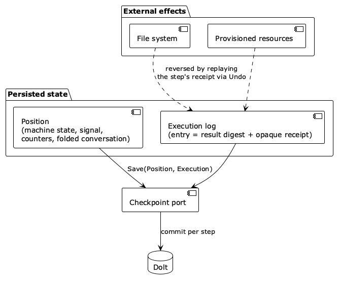
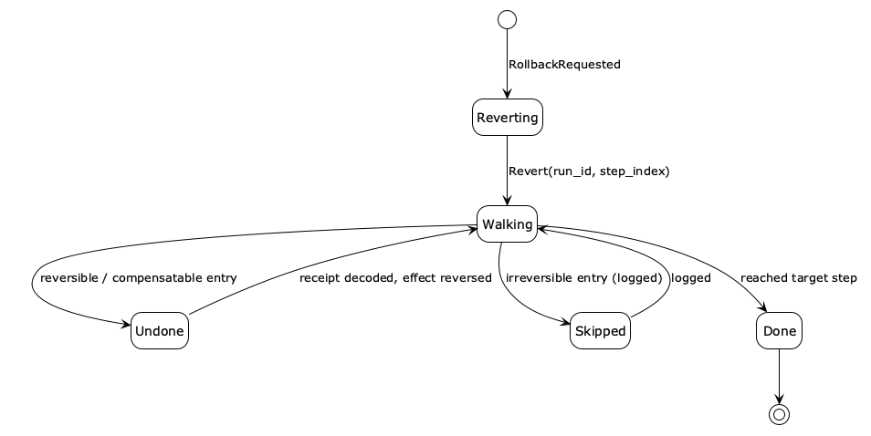

# Bidirectional Log

This chapter presents the Bidirectional Log pattern, which treats the recorded execution as a bidirectional log. The engine walks it backward, calling Undo on each tool in reverse order. The chapter covers the rollback lifecycle machine, checkpoint-based partial rollback, and the handling of irreversible tools.

## Intent

Walk the recorded execution backward, calling Undo on each tool in reverse, so recovery from a mistaken step is mechanical rather than probabilistic.

## Motivation

An execution is not a log. Logs are append-only records of the past; an execution is a record the engine traverses both ways. Forward traversal is normal execution, dispatching a tool, recording $(state, signal, tool, result)$, and advancing. Backward traversal is undo. From the last entry, the engine calls `Undo` on each tool in reverse, dismantling what forward execution built. Both directions use the same record: every entry the forward pass recorded carries enough to reverse it, so no separate undo log exists.

This matters because agents make mistakes. The model picks the wrong tool, writes broken code, misreads a requirement. Without rollback the only recovery is to restart or to ask the model to fix its own errors, which compounds mistakes rather than correcting them. With rollback the engine retracts the last N steps, restores the workspace, and tries a different path.

## Applicability

Bidirectional Log fits agents whose actions have side effects that may need undoing — file writes, state mutations, provisioned resources. It is particularly valuable when recovery should be mechanical rather than a second LLM attempt layered on a contaminated history, when speculative execution is useful (try a reversible plan, roll back if unsatisfactory), and when irreversible effects need to be recorded for audit. Agents with no side effects, or whose side effects are naturally idempotent, gain little from the pattern.

## Structure

A correct rollback restores three layers of state in coordination, shown as a package diagram in Fig. 19. **Agent state** is the engine's position (machine state, signal, iteration, budget), cheap to snapshot. **Domain state** is the accumulated product of tool dispatches (parsed responses, generated code, conversation history). **Workspace state** is the external world (files, git commits, provisioned resources), the most expensive to restore. Restoring one layer while leaving another stale is broken; checkpoints bind all three to the same logical point.

| **Figure 19.** Package diagram. The three state layers an execution touches; correct rollback restores all three together. |
|:---:|

### Participants

#### UndoMemento

The UndoMemento is a serialized payload a tool writes during `Execute`, carrying enough to reverse the effect without the original object, such as a file path, prior content, or a resource identifier.

#### Checkpoint

The Checkpoint is a snapshot of all three layers at one point.

#### Lifecycle machine

The lifecycle machine is a separate, minimal machine that walks the execution backward; keeping it out of the domain machine separates *what the agent does* from *how it recovers*. Mementos carry the reversibility tier of Chapter 4:

| Memento kind | Undo behaviour |
|---|---|
| Noop | Read-only; skip during rollback |
| Reversible | Restore original state exactly |
| Compensatable | Issue a corrective action, log the difference |
| Irreversible | Skip, log as non-reversible |

## Collaborations

### The lifecycle machine

Rollback runs as its own finite-state machine over the primary machine's execution and checkpoints. The state machine diagram in Fig. 20 shows it: from **Scanning**, each entry is **Undone** (reversible/compensatable), **Skipped** (irreversible, logged), or triggers **Restoring** when a checkpoint boundary is reached; **Done** returns control to the primary machine.

| **Figure 20.** State machine diagram. The lifecycle machine walks the execution backward, undoing reversible tools, skipping irreversible ones, and restoring from a checkpoint when one is reached. {wide 0.7} |
| :-------------------------------------------------------------------------------------------------------------------------------------------------------------------------------------------------------------: |

A separate machine pays off three ways: it is small enough to validate exhaustively; different rollback strategies are just different lifecycle machines; and it reads the execution and checkpoints but never dispatches a domain tool, so it cannot accidentally advance the domain machine.

### Compensation at boundaries

Each entry is processed by its tier. **Reversible: local undo.** The tool restores exactly what it changed (restore file content, write back a prior value). **Compensatable: boundary compensation.** Exact reversal is impossible but a corrective action restores equivalent state (delete a created resource); the memento carries the resource identifier and documents semantic differences (a re-created resource gets a new ID). **Irreversible: skip and log.** An email sent or deployment published cannot be undone; the entry is logged explicitly in the rollback report with tool, iteration, and reason. Per-entry tier classification, not a global setting, lets a single rollback handle mixed tiers.

## Consequences

### Benefits

#### Mechanical recovery

Retracting N steps and restoring the workspace is deterministic, not a probabilistic second attempt; fresh continuation gives the model the pre-error context without the contamination of failed tries.

#### Cheap exploration

When a plan is all reversible, the agent executes speculatively and rolls back automatically, leaving no residue.

#### Auditable irreversibility

Skipped irreversible entries appear in the rollback report, so operators see exactly which effects persist.

### Liabilities

#### Checkpoint overhead

Snapshotting all three layers has cost, so checkpoints are triggered selectively (below), not per step.

#### An irreversibility floor

Once an irreversible tool commits, rollback can reach back only to the pre-commitment checkpoint; the irreversible effect is permanent.

#### Coordination complexity

Restoring agent, domain, and workspace state together, across process boundaries, is more involved than a single undo stack.

## Implementation

### Undo paths and mementos

**Live undo** applies within the same process: the tool object is still in memory and reverses its effects directly, fast and precise. **Memento undo** applies after a process boundary (suspend then resume elsewhere): no original object remains, so a new instance replays the serialized UndoMemento. Every tool that modifies external state must produce a memento during `Execute`; a tool that declares itself reversible but produces none commits a contract violation caught at runtime. Static tier declaration enables planning; dynamic verification ensures the declaration holds.

### Checkpoints

Checkpoints are created on three triggers: **suspend** (pause for later resume, possibly on another machine), **pre-commitment** (before an irreversible tool, establishing the rollback floor), and **policy** (every N iterations or budget threshold, bounding work lost to a crash). Each bundles an agent snapshot, a history digest, a workspace reference (git commit or filesystem snapshot), and conversation state. Restoring overwrites the engine position, resets the workspace to the reference, reloads the conversation, and discards later execution entries; no per-tool `Undo` runs during a pure checkpoint restore.

### Forward after backward

Resuming after rollback is a *fresh continuation*, not a replay: rolled-back entries are discarded, and the engine proceeds from the checkpoint with a clean execution tail and a conversation reset to that point. Replaying would reproduce the same mistake. A new checkpoint is written at the resume point (same workspace reference, truncated execution); original post-checkpoint entries are preserved only in the rollback audit log.

### Planning with reversibility

Tier classification turns into active planning strategies: **speculative execution** for all-reversible plans; **commitment phases** that explore with reversible tools and cross into irreversible commitment only when evidence suffices, guarded by a pre-commitment checkpoint and a confirmation state; and **saga-style compensation** [@garcia-molina-sagas-1987] for mixed plans, where the lifecycle machine derives the compensation order from the execution (reverse of execution) rather than hardcoding it.

## Relationships in the Pattern Language

Bidirectional Log sits within Machine Interpreter and requires Machine Interpreter and Tool Contract: rollback needs a closed execution record plus tool-level undo and reversibility declarations. It enables Approval Gate, which checkpoints before an external decision, and Operator Port, which can expose rollback and lifecycle operations safely through the running machine. The complete grammar is maintained in `pattern-language.yaml`.

## Known Uses

**Coding agents.** Generators write files speculatively; when validation fails, the lifecycle machine reverts the workspace to the last checkpoint and the model retries with clean context instead of debugging its own contaminated history.

**Gated deployment.** A pre-commitment checkpoint before an irreversible `deploy` tool sets the rollback floor; if post-deploy checks fail for reasons outside the deploy itself, execution returns to that floor, while the deploy is logged as non-reversible (Chapter 10).

**Multi-step API plans.** Sequences mixing compensatable resource creation and irreversible notifications use saga-style compensation (created resources are deleted in reverse order, irreversible steps logged) without a hand-written compensation sequence.

**Database transactions and rollback** [@gray-1978]. The canonical model of a durable, reversible sequence of operations with a commit boundary, where rollback restores the prior consistent state, is the closest classical analogue of walking an execution backward to a checkpoint.

**Memento pattern** [@gamma-gof-1994]. Capturing an object's state so it can be restored later without violating encapsulation is exactly the UndoMemento each tool records during `Execute`.

**Event Sourcing** [@fowler-event-sourcing-2005]. Modelling state as a replayable and reversible log of events matches the execution record directly: it is the same kind of traversable log, read forward to run and backward to undo.
