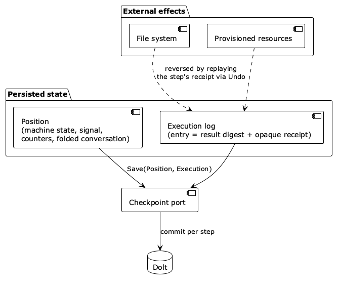
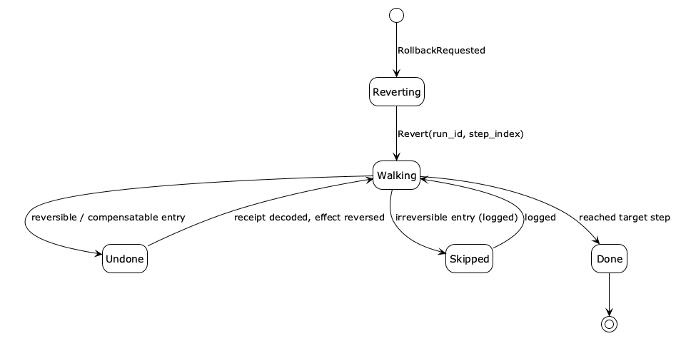

<!-- Copyright (c) 2026 Nokia -->
<!-- SPDX-License-Identifier: BSD-3-Clause -->

# Bidirectional Log

A Bidirectional Log treats the recorded execution as a two-way log, persisted
one commit per step. Forward traversal follows normal execution; backward
traversal is rollback: a git-style revert of the persisted state, then a
reverse walk replaying each step's receipt through the owning tool's Undo.
Components include a typed checkpoint port, Dolt-backed history,
receipt-driven undo, a two-part rollback mechanism, and an explicit story for
irreversible tools.

## Intent

Record execution as an ordered log, persisted one commit per step, enabling
mechanical recovery from a mistaken step. Rewind the persisted state with a
git-style revert, then reverse external effects by replaying each step's
receipt through the tool's Undo mechanism.

## Reference implementation status

The runtime includes the typed checkpoint port, Dolt commit-per-step history,
and `Revert`, along with receipt persistence, reverse receipt walking, and the
internal `checkpoint_rollback` lifecycle tool. Tests cover DB rewind and clean
or partially failed receipt reversal.

No production coding-agent profile routes validation failure into
`checkpoint_rollback`. The deployment confirmation flow exists only in Chapter
10's Approval Gate conformance/design material. Automatic coding retry, gated
deployment recovery, and generated compensation for mixed API plans are part
of the design intent.

## Motivation

Executions differ from append-only logs. Logs record the past, but executions
are bidirectional records the engine traverses. Forward traversal is normal
execution: dispatch a tool, record $(state, signal, tool, result)$ and its
receipt, commit, and advance. Backward traversal is undo: revert state to a
target step, then pass restored results to each tool's `Undo` in reverse
order. Both directions use the same record. As each entry includes the tool's
receipt—holding all reversal data—no separate undo log is needed.

Agents make mistakes: the model selects the wrong tool, writes faulty code, or
misinterprets requirements. Without rollback, recovery requires restarting or
asking the model to self-correct, which often worsens errors. With rollback,
the engine retracts the last N steps—reverting the database, replaying
receipts to reverse files and resources—and proceeds differently.

## Applicability

Bidirectional Log suits agents whose actions produce reversible side effects
like file writes, state mutations, or resource provisioning. It's useful when
recovery is automated, speculative execution is beneficial, or irreversible
effects need logging. This pattern requires versioned, incrementally persisted
state (e.g., Dolt commits each step) and undoable external effects via
receipts. Agents with no side effects or inherently idempotent actions gain
little from this approach.

## Structure

A correct rollback separates two concerns bound to the same step index (Fig.
19). **Persisted state** includes resumable position (machine state, signal,
iteration, budget counters, folded conversation) and the ordered execution log
(result digest, tool's opaque receipt). This state is saved via a typed
checkpoint port and versioned commit-per-step by the Dolt backend. **External
effects** refer to the world outside the database (files, provisioned
resources), not captured by snapshots; they are reversed by replaying receipts
through the tool's `Undo`. Rewinding persisted state without external effects,
or vice versa, is incomplete: rollback reverts the database to a step and
walks receipts back to that step.

| **Figure 19.** Package diagram. The two concerns a rollback coordinates at one step index: persisted state (Position and Execution) saved through the checkpoint port and versioned by Dolt, and external effects reversed through per-step receipts. |
|:---:|

### Participants

#### Receipt

The Receipt is an opaque string encoded by a tool during `Execute`, containing
data to reverse the effect without the original object—a file path, prior
content, a resource identifier, and a commit hash. The tool controls the
receipt's schema and decodes it exclusively; the engine and checkpoint
adapters store it verbatim without interpretation.

#### Checkpoint port

The Checkpoint port, a typed, two-method persistence seam, includes `Save
(Position, Execution)` to record resumable position and ordered log as one
unit, and `Load` to restore them. Adapters handle serialization and storage.
The default adapter is Dolt, committing each step; `NoopCheckpoint` disables
persistence without overhead.

#### Execution

The Execution maintains an ordered dispatch log, recording each iteration,
state pair, signal, command, result digest, and receipt in dispatch order to
enable forward inspection and reverse traversal. This log is versioned as a
Dolt commit-per-step history, ensuring a detailed, traceable record of each
step.

#### Lifecycle tool

Rollback, a dedicated lifecycle tool (`checkpoint_rollback`), operates
separately from engine code and the domain machine. This separation keeps *the
agent's actions* and *its recovery mechanisms* distinct. The rollback process
has two stages: executing Dolt `Revert` to restore persisted state, then
performing a reverse receipt walk. This method aligns with the reversibility
tier in Chapter 4.

| Reversibility tier | Undo behaviour |
|---|---|
| Noop | Read-only; empty receipt; skipped during rollback |
| Reversible | `Undo` decodes the receipt and restores the prior state |
| Compensatable | `Undo` derives a corrective action from the receipt, logs the difference |
| Irreversible | Skipped, logged as non-reversible |

## Collaborations

### The lifecycle tool

Rollback, invoked by a minimal lifecycle machine, traverses the run's
Execution and Dolt commit history. Fig. 20's state machine shows this: from
the **Reverting** state (`Revert (run_id, step_index)` rewinds persisted
state), it walks entries in reverse, marking them **Undone**
(reversible/compensatable) or **Skipped** (irreversible, logged). The **Done**
state then returns a resumable position.

| **Figure 20.** State machine diagram. The lifecycle tool reverts persisted state to the target step, then walks the later entries backward, undoing reversible tools through their receipts and skipping irreversible ones. {wide 0.7} |
| :-------------------------------------------------------------------------------------------------------------------------------------------------------------------------------------------------------------------: |

A lifecycle tool has three advantages. It is small enough to validate
exhaustively. Each rollback strategy is its own lifecycle tool. And it drives
`Undo` from the execution and commit history without ever dispatching a domain
tool, so the domain machine cannot progress by accident.

### Reversal by tier

Each reverted entry is processed according to its tier. **Reversible: local
undo.** The tool's `Undo` decodes the receipt and restores exactly what it
changed (restore file content, write back a prior value). **Compensatable.
Corrective action.** Exact reversal is impossible, but `Undo` derives a
corrective action from the receipt that restores equivalent state (delete a
created resource). The receipt carries the resource identifier, and semantic
differences are documented (a re-created resource gets a new ID).
**Irreversible. Skip and log.** An email sent or deployment published cannot
be undone; the entry is logged explicitly in the rollback report with tool,
iteration, and reason. Per-entry tier classification, not a global setting,
allows a single rollback to handle mixed tiers.

## Consequences

### Benefits

#### Mechanical recovery

Reverting the database to a step and replaying receipts reverses external
effects deterministically, not probabilistically. This ensures fresh
continuation provides the model with pre-error context, uncontaminated by
failed tries.

#### Cheap exploration

The agent speculatively executes entirely reversible plans and automatically
rolls them back, ensuring no residue remains.

#### Auditable irreversibility

Skipped irreversible entries appear in the rollback report, showing operators
which effects persist.

#### One persistence seam

Position and Execution use the same typed port into Dolt, ensuring the
ordered, versioned history for rollback and inspection comes from a single
commit-per-step store rather than a separate snapshot format.

### Liabilities

#### Commit overhead

Committing each step costs resources, so persistence is optional;
`NoopCheckpoint` prevents disabled runs from incurring this overhead.

#### An irreversibility floor

An irreversible tool's external effect cannot be reversed by the receipt walk;
`Revert` rewinds only the database, leaving the external effect permanent.

#### Two-part coordination

Rewinding persisted state and replaying receipts must target the same step
index, simplifying the process versus managing three separate state layers.
The revert and receipt walk must still align at the rollback's conclusion.

## Implementation

### Receipts and undo paths

**Live undo** operates within the same process. The tool stays in memory,
letting `Undo` directly reverse the in-memory result for speed and precision.
**Post-restart undo** handles process boundaries like suspend and resume:
`Load` restores the receipt-bearing result, and a new tool instance's `Undo`
uses the receipt. State-mutating tools encode a receipt during `Execute`;
read-only tools return an empty receipt and a no-op `Undo`. Enforcement is
split. The lifecycle validator checks receipt *presence* for reversible
state-mutating tools, while receipt *sufficiency* — the receipt's ability to
reverse the effect — is verified by the tool's round-trip test rather than the
engine. Static tier declaration enables planning; the presence check and
round-trip test ensure honesty.

### Commit-per-step history

The Dolt backend commits each dispatched step, ensuring the execution log is a
versioned history rather than periodic snapshots. `Save` records the
Position—machine state, signal, budget counters, and folded conversation—and
the appended Execution entry as one unit in a single commit. The port persists
on every step, removing the need for a snapshot policy. Suspend persists
through the same port before exit, and `Load` resumes by restoring the
Position and Execution, re-entering the machine at the restored position.

### Rollback: revert then replay

Rolling back to step $k$ involves two moves over the same index. First,
`Revert (run_id, k)` rewinds the persisted state — Position and Execution — to
step $k$. Second, the lifecycle tool walks entries $k{+}1 \ldots n$ in
reverse, handing each reverted entry's result to `Undo`, while skipping and
logging irreversible entries in the rollback report. The process returns the
machine position at step $k$, enabling execution to resume as a *fresh
continuation* rather than a replaying. Discarded entries are preserved only in
the rollback report.

### Planning with reversibility

Dynamic planning strategies include **speculative execution** for
all-reversible plans, **commitment phases** using reversible tools until
sufficient evidence triggers irreversible commitment (protected by a
confirmation state), and **saga-style compensation**
[@garcia-molina-sagas-1987] for mixed plans, where the lifecycle tool derives
compensation order from execution (reverse of dispatch) rather than hardcoding
it.

## Relationships in the Pattern Language

Bidirectional Log integrates with the Machine Interpreter, requiring both the
Machine Interpreter and Tool Contract for operation. Rollback relies on a
closed execution record, receipt-driven undo mechanisms at the tool level, and
explicit reversibility declarations. This integration supports the Approval
Gate, which checkpoints before external decisions, and a fully implemented
Operator Port exposes rollback and lifecycle operations directly through the
running machine. The system's complete grammar is in `pattern-language.yaml`.

## Design intent scenarios

**Automatic coding recovery.** A future coding profile could route validation
failures to `checkpoint_rollback`, restore files via receipts, and retry with
a clean context. No production profile currently implements this transition.

**Gated deployment recovery.** A deployed Approval Gate could set a rollback
floor before irreversible deploys and restore reversible pre-deploy effects
after failed verifications. The shipped approval material is a conformance
fixture rather than deploying or rolling back rejections.

**Generated API compensation.** A future planner may derive compensation
orders for mixed resource creation and irreversible notifications from
execution. No shipped profile shows this orchestration.

## Known Uses

**Reference rollback mechanics.** The Dolt checkpoint adapter processes each
dispatch, reverts the persisted Position and Execution to a designated step,
and maintains receipts separately from the redacted tool output. The lifecycle
receipt walker executes `Undo` in reverse sequence, handles previously
classified failures, and logs skipped effects.

**Database transactions and rollback** [@gray-1978]. The canonical model of a
durable, reversible sequence of operations with a commit boundary, where
rollback restores the prior consistent state, is more than an analogue. The
Dolt backend literally commits each step and reverts to a prior consistent
state.

**Memento pattern** [@gamma-gof-1994]. Each tool encodes a Receipt during
`Execute`, capturing an object's state for later restoration while hiding
internal workings. The tool holds the schema, the engine and Dolt adapter
store it opaquely, and only the originating tool decodes it on `Undo`. The
pattern's encapsulation boundary is enforced rather than assumed.

**Event Sourcing** [@fowler-event-sourcing-2005] models state as a replayable,
reversible event log, aligning with Dolt's commit-per-step execution. This
approach offers a traversable log for executing operations forward and
reverting them backward, mirroring Dolt's commit-per-step functionality.
