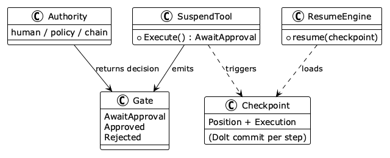
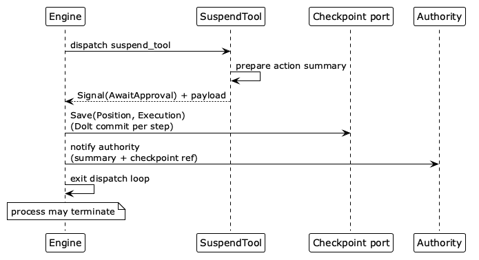

# Approval Gate

This chapter presents the Approval Gate pattern, which suspends execution at a declared machine state, checkpoints the full execution, and waits for an external authority to approve or reject. The chapter covers the suspend-checkpoint-notify sequence, the resume and rollback paths, and the control-plane API that receives the decision.

## Intent

Suspend execution at a declared state, checkpoint it, and resume or roll back on an external decision without losing execution context across the suspension.


## Motivation

Agents that modify production systems need confirmation gates: before deploying, deleting data, or provisioning, a human should review what the agent proposes and decide. Two ad-hoc approaches both fail. **Callback gates** block a thread or register a callback, which is lost if the process restarts (crash, deployment, timeout, migration), forcing a restart from scratch. **Polling gates** write to a queue and poll, but every gate then serializes its own context and reconstructs its own state, with no shared infrastructure and no guarantee the restored state matches the original.

Both bolt the gate onto control flow imperatively. In the Machine Interpreter the gate is a declared transition, a signal triplet backed by the same checkpoint infrastructure that supports suspend and resume. Structural, not procedural.


## Applicability

The Approval Gate fits agents that can take irreversible actions — deployments, deletions, transactions — before which a human or automated authority must confirm. It is especially suited when a decision may take hours or days, requiring execution to survive process boundaries; when multiple authorities must sign off in sequence; or when an audited decision trail matters. Do not gate decisions the agent can make autonomously; unnecessary gates serialize a fast pipeline through human latency. Gate placement follows the reversibility tiers of Chapter 4: gate before irreversible tools, not before reversible ones.


## Structure

Suspending, gating, and resuming execution involves five participants, related as the class diagram in Fig. 26 shows.



| **Figure 26.** Class diagram. The participants: the Gate signal triplet, the Checkpoint, the Authority, the SuspendTool, and the ResumeEngine. |
|:---:|

### Participants

#### Gate

The signal triplet `AwaitApproval`/`Approved`/`Rejected`, ordinary machine signals handled by ordinary transitions, nothing special to the engine.

#### Checkpoint

The typed snapshot persisted at suspension through the Chapter 7 checkpoint port: the resumable Position (machine state, counters, folded conversation) and the ordered Execution log, committed by the Dolt backend.

#### Authority

The external decision-maker (human, policy engine, or chain of approvers); how it decides is outside the pattern.

#### SuspendTool

Emits `AwaitApproval` with a human-readable action summary.

#### ResumeEngine

Loads a checkpoint and re-enters the loop, continuing past the gate on `Approved`, routing to rollback or an alternative path on `Rejected`.


## Collaborations

The state machine diagram in Fig. 27 shows the lifecycle: `AwaitApproval` checkpoints and suspends, `Approved` resumes, `Rejected` routes to rollback.


| **Figure 27.** State machine diagram. The approval-gate lifecycle: `AwaitApproval` checkpoints and suspends; `Approved` resumes; `Rejected` routes to rollback. {wide} |
|:---:|

**Suspension** proceeds in strict order, traced by the sequence diagram in Fig. 28: the engine dispatches the suspend tool like any other; the tool returns `AwaitApproval` with an action summary; the engine checkpoints the run through the Chapter 7 port — saving the Position and Execution, committed by the Dolt backend — notifies the authority with the summary and checkpoint reference, and exits the loop. The process may then terminate; an arbitrary time may pass with full state living in the checkpoint.



| **Figure 28.** Sequence diagram. The SuspendTool emits `AwaitApproval`; the engine persists a checkpoint, notifies the authority, and exits the dispatch loop, after which the process may terminate. {wide} |
|:---:|

**Resumption** is signal injection into a loaded checkpoint. On `Approved`, the engine restores the Position and conversation from the typed snapshot (Chapter 7), injects `Approved`, and `(Suspended, Approved)` routes to the gated tool; a possibly different process resumes identically because both read the same checkpoint and machine. On `Rejected`, injecting `Rejected` routes to a rollback state — Dolt `Revert` for persisted state plus the lifecycle tool's reverse receipt walk for external effects (Chapter 7) — or to an alternative path such as `(Suspended, Rejected) -> Revising`, where the agent revises and re-enters the gate. Rejection policy is the machine author's choice.


## Consequences

### Benefits

#### Safe irreversible operations

Deployment, deletion, and provisioning tools can sit in the registry without being dangerous; the machine runs them only after approval.

#### Cross-session continuity

State lives in the checkpoint store, not a process, so the agent survives restarts, migrations, and long delays.

#### Auditable decisions

Each gate records the proposal, the decision, the time, and the decider, a compliance artifact.

#### Compositional gates

Multiple gates are just ordinary transitions, so multi-stage approval (staging then production) composes naturally.

### Liabilities

#### Human latency

Each gate serializes execution through a human; timeouts (`(Suspended, Timeout) -> Failed`) mitigate but do not remove it.

#### Checkpoint storage

Each gate persists potentially large state, needing cleanup policies.

#### Context staleness

The world may change between suspend and resume, so the machine author must re-validate preconditions before executing the gated action.


## Implementation

Suspend is an `internal` lifecycle tool (the machine dispatches it at a declared point, so the model cannot skip the gate by declining to call it) and `noop`-reversible, since checkpointing, not the tool, captures state:

```yaml
- name: suspend_for_approval
  visibility: internal
  parameters: { action_summary: {type: string}, affected_paths: {type: array} }
  emits: [AwaitApproval]
  reversibility: noop
```

A gate checkpoint is the standard checkpoint (the Position — agent snapshot and folded conversation — and the ordered Execution log, committed by the Dolt backend) plus gate metadata, namely the action summary, gate status, and an authority record (who decided, when, why), which turn it from a resume mechanism into an audit artifact. Resume is a CLI operation that maps flags to the resume engine's inputs:

```
agent resume --checkpoint <id> --signal Approved
agent resume --checkpoint <id> --signal Rejected --reason "scope exceeds authorization"
```

Automated approval uses the same path. A policy engine monitors pending gates and injects the signal programmatically; manual and automated approval are identical to the engine. Static analysis can warn when an irreversible tool is reachable without passing a gate, but whether to add it remains the author's call.


## Relationships in the Pattern Language

Approval Gate sits within Machine Interpreter and requires Machine Interpreter, Tool Contract, Bidirectional Log, and Phase-Scoped Toolset: the gate is a declared transition, the gated operation has a contract, rollback handles rejection, and scoped manifests keep commitment tools unreachable before approval. It enables Operator Port because the resume decision can arrive as a validated control-plane signal. The complete grammar is maintained in `pattern-language.yaml`.


## Known Uses

**Deployment confirmation.** A coding agent gates between validation and deployment: after tests pass, the machine suspends with a deployment diff (files changed, services affected, rollback path). Approval deploys; rejection rolls back to the pre-deployment checkpoint, leaving production untouched. Data-cleanup agents gate similarly, presenting records and rationale for each deletion, with every decision recorded for compliance.

**Multi-step authorization chains.** Budget-exceeding procurement might need team-lead approval at \$1,000, director at \$10,000, and VP at \$50,000, three sequential gates, each a different authority checkpointing independently. If any rejects, the agent rolls back to the last approved checkpoint, preserving work earlier authorities already blessed.

**Two-phase commit** [@gray-1978]. A coordinator prepares participants and waits for a decision before the irreversible commit, the same suspend-then-decide-then-commit structure the gate imposes before an irreversible tool.

**Durable waits in workflow engines.** **Temporal** [@temporal-2024] offers durable execution with signals that pause a workflow until an external decision arrives, surviving process restarts, and **AWS Step Functions callback tasks** [@aws-step-functions-callback-2024] suspend a task on an external callback token before resuming. Both match the declared wait-and-resume structure of an approval gate, corroborating that surviving arbitrary suspension is a solved, recurring shape.
