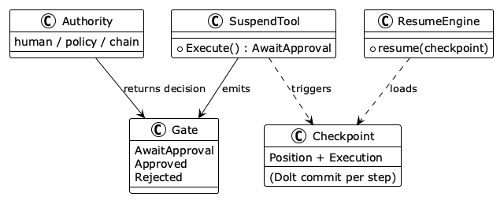
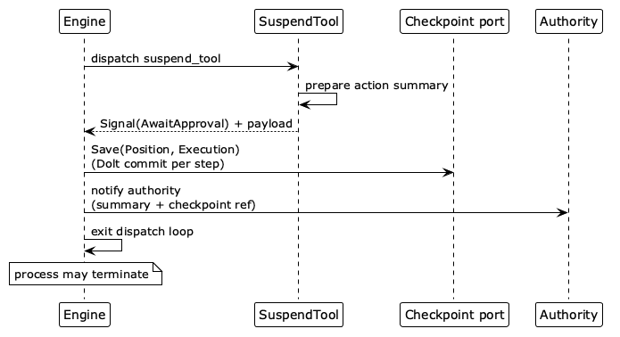

# Approval Gate

An Approval Gate stops execution at a specified machine state, creates a
checkpoint, and then waits for external approval or rejection. The complete
pattern goes beyond the lifecycle-conformance fixture shown in the reference
implementation, and the two remain distinct.

## Intent

We suspend execution at a declared state, checkpoint the context, and either
resume or roll back according to an external decision, thereby preserving the
execution context during the pause.

## Reference implementation status

The provided conformance fixture demonstrates a Dolt-backed suspend and a CLI
invocation that resumes the stored Position and Execution with `Approved` or
`Rejected`. An approval leads to `Succeeded`; a rejection leads to `Rejected`.
This fixture serves as a conformance test, not as a deployed approval gate.

Authority notification, proposal and decision metadata, decider identity,
rejection-triggered rollback, multi-authority chains, and a deployed
confirmation API remain design intent. The standard checkpoint captures the
resumable Position and the ordered Execution log, but it omits any
approval-decision records.

## Motivation

Agents that alter production systems need confirmation gates: before
deployment, data deletion, or provisioning, a human must review the agent's
proposal and issue a decision. Callback gates pause a thread or register a
callback, but they disappear after a process restart (crash, deployment,
timeout, migration), forcing a fresh start. Polling gates write to a queue and
poll, yet each gate serializes and rebuilds its own state, lacking shared
infrastructure and ensuring no alignment with the original state.

Both approaches attach the gate to control flow imperatively. The gate
functions as a declared transition—a signal triplet—backed by the same
checkpoint infrastructure that supports suspend and resume. It therefore
represents a structural, not procedural, addition.

## Applicability

The Approval Gate applies to agents that perform irreversible
actions—deployments, deletions, transactions—and therefore require prior human
or automated approval. It becomes valuable when decisions extend over hours or
days, demand sequential sign-offs, or must leave an auditable trail. We should
avoid gating autonomous decisions, because unnecessary gates introduce human
latency. Chapter 4 recommends placing gates before irreversible tools rather
than before reversible ones.

## Structure

Suspending, gating, and resuming execution involve five distinct participants,
whose relationships appear in the class diagram (Fig. 26).



| Figure 26. Class diagram. The participants: the Gate signal triplet, the Checkpoint, the Authority, the SuspendTool, and the ResumeEngine. |
|:---:|

### Participants

#### Gate
The signal triplet `AwaitApproval` / `Approved` / `Rejected` behaves as an ordinary machine signal handled by standard transitions, requiring no special support from the engine.

#### Checkpoint
The typed snapshot persisted at suspension through the Chapter 7 checkpoint port includes the resumable Position (machine state, counters, folded conversation) and the ordered Execution log, both committed by the Dolt backend.

#### Authority
The external decision-maker—whether a human, policy engine, or chain of approvers—operates independently of the prompt pattern; its decision process lies outside the pattern.

#### SuspendTool
The shipped tool emits `AwaitApproval` with the configured reason, records a trace event, suspends the loop, and does not contact an authority.

#### ResumeEngine
The system loads a checkpoint, re-enters the loop, and proceeds beyond the gate when the status is `Approved`. If the status is `Rejected`, it routes to rollback or an alternative path.

## Collaborations

Figure 27 illustrates the state-machine transitions: `AwaitApproval`
checkpoints and suspends, `Approved` resumes, and `Rejected` may route to
rollback. The conformance fixture, however, terminates directly at `Rejected`
without performing a rollback.


| Figure 27. State machine diagram of the complete pattern. The fixture covers suspend and both decision signals, but not rejection rollback. {wide} |
|:---:|

Suspension follows a precise sequence (Fig. 28): the engine starts the suspend
tool, which returns `AwaitApproval` together with its predefined reason. The
engine checkpoints the run via the Chapter 7 port, preserving Position and
Execution, while the Dolt backend commits the changes, then the engine exits
the loop. The process terminates, permitting arbitrary time to elapse with
state stored in the checkpoint. Notifying an authority with a proposal and
checkpoint reference would complete the pattern, but the reference runtime
omits this notification.



| Figure 28. Sequence diagram of the complete pattern. The shipped path persists and exits; the authority-notification step remains design intent. {wide} |
|:---:|

Resumption injects a signal into a loaded checkpoint. The runtime restores
Position and conversation state, then injects the value supplied by
`--resume-signal`. In the fixture, `Approved` signals route from `done` to
`Succeeded`, while `Rejected` signals go directly to `Rejected`, bypassing
rollback. Production machines may route a rejection to revision or checkpoint
rollback, but those paths await deployed profiles and focused tests.

## Consequences

### Benefits

* **Safe irreversible operations** -- Deployment, deletion, and provisioning tools can reside in the registry without posing a threat, because the machine executes them only after receiving approval.  
* **Cross-session continuity** -- Storing state in the checkpoint store rather than in a process allows the agent to survive restarts, migrations, and long delays.  
* **Auditable decisions** -- A complete gate captures the proposal, decision, timestamp, and decider as a compliance artifact; the shipped checkpoint lacks these fields.  
* **Compositional gates** -- Gates act as transitions, enabling natural composition of multi-stage approvals. Staging precedes production, ensuring structured progression through each gate.  

### Liabilities

* **Human latency** -- Each gate introduces a human intervention point, creating a dependency. Timeouts such as `(Suspended, Timeout) -> Failed` reduce but do not eliminate this serialization.  
* **Checkpoint storage** -- Each gate persists potentially large state, which requires policies for cleanup.  
* **Context staleness** -- The machine re-validates preconditions before executing the gated action, because the external world may have changed between suspend and resume.  

## Implementation

Suspend functions prevent the model from bypassing the gate by omitting its
invocation, acting as an `internal` lifecycle-boundary tool. The shipped
declaration is compensatable, allowing the process to resume with an explicit
decision or to roll back to an earlier checkpoint.

```yaml
- name: suspend
  type: builtin
  init: suspend
  visibility: internal
  emits: [AwaitApproval, CommandError]
  config:
    label: approval
    reason: awaiting approval
    require_checkpoint: false
  reversibility:
    classification: compensatable
    undo: resume_with_rejected_or_rollback_checkpoint
```

The fixture uses the standard checkpoint, which includes Position (machine
state, counters, and folded conversation) plus the ordered Execution log. Gate
metadata—such as proposal, status, decider, decision time, and rationale—is
not part of the shipped checkpoint. Adding those fields remains design intent.

Resume uses universal runtime flags with the standard `agent` command. It
lacks a lifecycle-specific resume subcommand and a `--reason` flag.

```bash
bin/agent --profile "$AGENT_CATALOG_ROOT/testdata/conformance/lifecycle/approval/profile.yaml" \
  --dolt-dsn "$DOLT_DSN"

bin/agent --profile "$AGENT_CATALOG_ROOT/testdata/conformance/lifecycle/approval/profile.yaml" \
  --dolt-dsn "$DOLT_DSN" \
  --resume-checkpoint "$RUN_ID" \
  --resume-signal Approved

bin/agent --profile "$AGENT_CATALOG_ROOT/testdata/conformance/lifecycle/approval/profile.yaml" \
  --dolt-dsn "$DOLT_DSN" \
  --resume-checkpoint "$RUN_ID" \
  --resume-signal Rejected
```

The conformance test obtains `RUN_ID` from the persisted Dolt run branch. A
future authority service could reuse the same flags or an equivalent
control-plane signal path, but pending-gate discovery and programmatic
authority notification are not shipped.

## Relationships in the Pattern Language

The Approval Gate, as part of the Machine Interpreter, depends on the Machine
Interpreter, Tool Contract, Bidirectional Log, and Phase-Scoped Toolset. It
functions as a declared transition: the gated operation follows a contract,
rollback mechanisms address rejection, and scoped manifests keep commitment
tools locked until approval. This gate enables the Operator Port to accept the
resume decision as a validated control-plane signal. The full grammar resides
in `pattern-language.yaml`.

## Known Uses

**Lifecycle approval conformance fixture.** Located at `applications/catalog/testdata/conformance/lifecycle/approval`, this fixture handles `suspend` operations, persists data via Dolt, and resumes functionality using universal CLI flags. It validates both approved and rejected terminal routing, but it excludes notification, decision metadata, rejection rollback, and deployment.

**Deployment confirmation (design intent).** A coding agent can act as a gate between validation and deployment: approval triggers deployment, while rejection rolls back to the pre-deployment checkpoint. Currently, no shipped coding-agent profile implements this flow.

**Multi-step authorization chains (design intent).** The generic pattern employs sequential thresholds and independent authority records, yet the reference implementation lacks a deployed chain and a defined authority-record schema.

**Two-phase commit** [@gray-1978]. The coordinator prepares participants, waits for a decision, then proceeds to the irreversible commit phase, mirroring the suspend-decide-commit structure enforced by the gate before executing an irreversible tool.

**Durable waits in workflow engines.** **Temporal** [@temporal-2024] ensures durable execution by pausing workflows via signals until an external decision is received, maintaining continuity across process restarts. **AWS Step Functions callback tasks** [@aws-step-functions-callback-2024] suspend execution using an external callback token, resuming upon signal receipt. Both mechanisms match the wait-and-resume structure of approval gates, confirming that surviving arbitrary suspension is a well-established pattern.