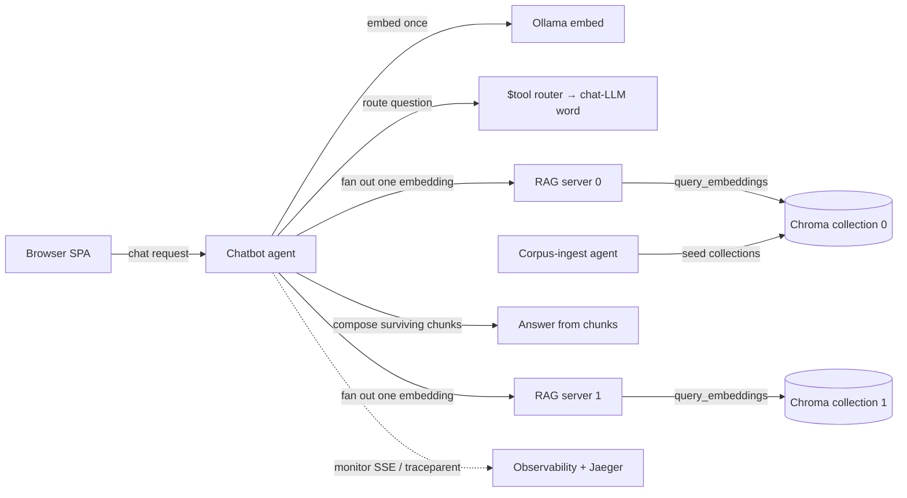

# chatbot-mesh

A routed, multi-RAG, observable, deployable chatbot built entirely from declarative agents on the agent-core runtime.

## What this is

The chatbot mesh is a copyable example program. A browser-facing chatbot agent runs a request-scoped turn: it embeds the message once, routes the question to a chat model, fans the embedding out to one or more retrieval-augmented generation (RAG) servers, composes an answer from the surviving sources' chunks, and streams observability for the turn. One Helm chart deploys the whole mesh, including an in-cluster model tier.

Every agent is a YAML profile the agent-core runtime loads. There is no bespoke orchestration code: the topology, the routing, the fan-out, and the deployment are configuration. The example demonstrates that a multi-agent system is a program you write in profiles and run on a shared runtime.

The example is a standalone *program*, not a standalone *runtime*. It runs on the published agent-core image the way a jar runs on a JVM. Copy the `examples/chatbot-mesh/` directory and it runs against agent-core with no dependency on any other profile in this repository.

For a reader's walkthrough of how the parts fit together — a single chat turn, live reconfiguration, and deployment, with diagrams — see [docs/how-it-works.md](docs/how-it-works.md).

## Turn flow



## Scope and status

The example spans both planes, and both are implemented. The data plane is the chatbot, the RAG servers, a corpus-ingest agent that seeds the vector store, observability, and Helm deployment. The control plane is a coordinator agent, a creator agent, and an executor that applies rollout changes to the running mesh. All six agents run on agent-core; `mage integration:controlPlane` exercises the coordinator and creator against a live mesh.

## Decisions

Four decisions frame the extraction. They are recorded here so a reader understands the shape of the example.

1. Standalone program on a shared runtime. The example runs on the agent-core image and references no profile outside this directory. It cites agent-core platform requirements (REST client tools, machine_request binding, monitor, mounted profiles, checkpoint, command-state, traceparent) as external references rather than restating them. Agent-core the runtime is a dependency; the other profiles in the catalog are not.

2. The mesh owns its Chroma retrieval config. The RAG server holds its Chroma REST config inline, and the copied corpus-ingest agent carries the retrieval config it needs. Nothing is shared with the knowledge-manager corpus demo, so a copy of the folder carries a working retrieval path.

3. Helm and UX are top-level directories. The chart lives under `helm/` and the single-page application under `ux/`, each clearly marked, rather than under `deploy/` or nested beneath an agent.

4. Co-generation stays, for now. The Helm chart renders the chatbot client config, the user interface, and the N-RAG fan-out from the chart values; the packaged profile copies are the local integration source and the render overrides them in the cluster. Inverting this so the profile is the source is a separate follow-up.

## Layout

```
examples/chatbot-mesh/
  docs/          VISION, ARCHITECTURE, road-map, and the example's own specs
  agents/        chatbot, rag-server, corpus-ingest (seed), coordinator, creator, executor
  ux/            the single-page application and UX config
  helm/          the deployment chart
  README.md      this file
  magefile.go    the example's own audit and integration entry
```

## Build

The example carries its own magefile. From this directory:

```bash
mage audit                     # validate the example's specification corpus
mage integration:chatbot       # run a routed fan-out chatbot turn
mage integration:controlPlane  # exercise the coordinator and creator control plane
```

Run `mage -l` to list the named `integration:*` targets (chatbot, ragServer, chroma, controlPlane, helmSmoke, helmSwap, helmLLMTier); each skips cleanly when its toolchain is absent.

`mage audit` is the self-governance gate. It runs the jurist validator over the example's own corpus, so it needs the agent-core runtime (`AGENT_CORE_ROOT`, default sibling `../agent-core`) and the jurist validator profile (`JURIST_PROFILE`, default sibling `agent-profiles/agents/jurist/profile.yaml`) — the two dev-time platform tools this gate depends on. Unlike the optional `integration:*` targets, it fails clearly rather than skipping when either tool is missing, so a copied-out example reports an honest failure instead of a false green.

The agents run on the agent-core image with a mounted profile, for example `agent --profile agents/chatbot/profile.yaml`. The Helm chart deploys the mesh on a kind cluster; see `helm/` for values and CI configuration.
