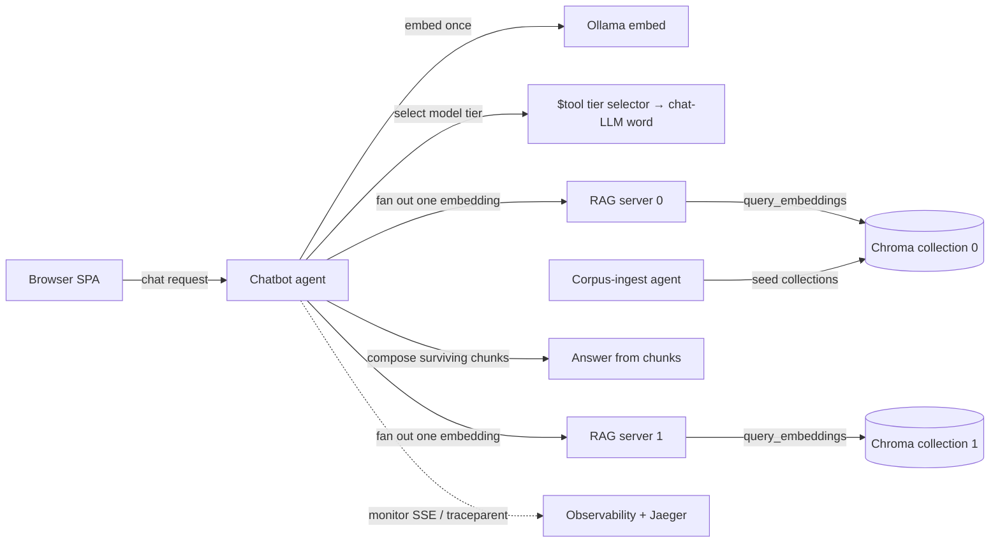

# chatbot-mesh

A routed, multi-RAG, observable, deployable chatbot built entirely from declarative agents on the agent-core runtime.

## What this is

The chatbot mesh is a copyable example program. A browser-facing chatbot agent runs a request-scoped turn: it embeds the message once, routes the question to a chat model, fans the embedding out to one or more retrieval-augmented generation (RAG) servers, composes an answer from the surviving sources' chunks, and streams observability for the turn. One Helm chart deploys the whole mesh, including an in-cluster model tier.

Every agent is a YAML profile the agent-core runtime loads. There is no bespoke orchestration code: the topology, the routing, the fan-out, and the deployment are configuration. The example demonstrates that a multi-agent system is a program you write in profiles and run on a shared runtime.

The example is a copyable *application*, not a standalone runtime or profile
library. It runs on the published agent-core image and keeps reusable corpus
ingest behavior canonically owned by `agent-profiles`. A copied directory needs
that profile checkout only while packaging or running local ingest integrations;
set `AGENT_PROFILES_ROOT` to it. The resulting Helm archive contains the
canonical closure and has no runtime dependency on the profile checkout.

For a reader's walkthrough of how the parts fit together — a single chat turn, live reconfiguration, and deployment, with diagrams — see [docs/how-it-works.md](docs/how-it-works.md).

## Turn flow


```mermaid
flowchart LR
  U[Browser SPA] -->|chat request| CB[Chatbot agent]
  CB -->|embed once| OLL[Ollama embed]
  CB -->|select model tier| TS["$tool tier selector → chat-LLM word"]
  CB -->|fan out one embedding| R0[RAG server 0]
  CB -->|fan out one embedding| R1[RAG server 1]
  R0 -->|query_embeddings| CH0[(Chroma collection 0)]
  R1 -->|query_embeddings| CH1[(Chroma collection 1)]
  CB -->|compose surviving chunks| ANS[Answer from chunks]
  ING[Corpus-ingest agent] -->|seed collections| CH0
  CB -.->|monitor SSE / traceparent| OBS[Observability + Jaeger]
```

## Scope and status

The example spans both planes. The data plane is the chatbot, the RAG servers, a corpus-ingest agent that seeds the vector store, observability, and Helm deployment. The control plane is a coordinator agent, a creator agent, and an applier that applies rollout changes to the running mesh. A seventh profile provides the staged declarative collector trace path while contrib retains metrics. The profiles run on agent-core. Release 05 remains partial pending one live ingest-to-grounded-turn proof, and Release 07 remains partial pending collector listener-rebind and final monitor-state lifecycle proof.

## Decisions

Four decisions frame the extraction. They are recorded here so a reader understands the shape of the example.

1. Copyable composition on shared platform assets. The example runs on the
   agent-core image. Its corpus-ingest wrapper references the canonical
   agent-profiles knowledge-manager program through the documented
   `AGENT_PROFILES_ROOT` build dependency; all other application agents remain
   local. Packaging embeds that canonical closure into the chart.

2. The mesh owns Chroma retrieval configuration, not reusable ingest behavior.
   The RAG server keeps its Chroma REST config inline, and
   `agents/corpus-ingest/` keeps the wrapper plus `corpus-rest.yaml`. Trusted
   discovery, machine, declarations, and tools come from the canonical library.

3. Helm and UX are top-level directories. The chart lives under `helm/` and the single-page application under `ux/`, each clearly marked, rather than under `deploy/` or nested beneath an agent.

4. Co-generation stays, for now. The Helm chart renders the chatbot client config, the user interface, and the N-RAG fan-out from the chart values; the packaged profile copies are the local integration source and the render overrides them in the cluster. Inverting this so the profile is the source is a separate follow-up.

## Layout

```
examples/chatbot-mesh/
  docs/          VISION, ARCHITECTURE, road-map, and the example's own specs
  agents/        chatbot, rag-server, corpus-ingest, coordinator, creator, applier, collector
  ux/            the single-page application and UX config
  helm/          the deployment chart
  README.md      this file
  magefile.go    the example's own audit and integration entry
```

## Build

The example carries its own magefile. From this directory:

```bash
mage audit                     # validate the example's specification corpus
mage helm:package              # stage profiles and build the installable chart
mage integration:chatbot       # run a routed fan-out chatbot turn
mage integration:controlPlane  # exercise the coordinator and creator control plane
mage integration:rig           # run hermetic agent scenarios, including collector intake
```

The shared ENG01 operator verbs are:

```bash
mage doctor      # read-only tool/version and Docker Desktop resource checks
mage demo:up     # create/reuse da-chatbot-mesh-demo and print .localhost URLs
mage demo:down   # delete only da-chatbot-mesh-demo
```

`demo:up` is an explicit request, so missing or outdated tools and insufficient
Docker Desktop resources fail with remediation instead of producing an
integration-style skip. A cluster created by a failed demo deployment is
removed; a pre-existing demo cluster is reused and never removed implicitly.

`mage helm:package` and local integrations that exercise corpus ingest resolve
the canonical program from `AGENT_PROFILES_ROOT`, defaulting to the monorepo's
`agent-profiles/` directory. Copying this example therefore requires an
agent-profiles checkout for build/test, but the packaged chart is self-contained
at runtime and does not silently fork the canonical program.

Run `mage -l` to list the named `integration:*` targets; each skips cleanly when its toolchain is absent. There is no `integration:collector` lifecycle target yet.

`mage audit` is the self-governance gate. It runs the jurist validator over the example's own corpus, so it needs the agent-core runtime (`AGENT_CORE_ROOT`, default sibling `../agent-core`) and the jurist validator profile (`JURIST_PROFILE`, default sibling `agent-profiles/agents/jurist/profile.yaml`) — the two dev-time platform tools this gate depends on. Unlike the optional `integration:*` targets, it fails clearly rather than skipping when either tool is missing, so a copied-out example reports an honest failure instead of a false green.

The agents run on the agent-core image with a mounted profile, for example `agent --profile agents/chatbot/profile.yaml`. The Helm chart deploys the mesh on a kind cluster; see `helm/` for values and CI configuration.

Driving the SPA in a browser needs the browser toolchain described under [Browser End-to-End Tests](../../agent-core/README.md#browser-end-to-end-tests). The `ux/app` package ships no browser driver of its own: the repository's `puppeteer-core` install lives in agent-core, and it launches only when `PUPPETEER_EXECUTABLE_PATH` or `CHROME_BIN` names a system browser.
