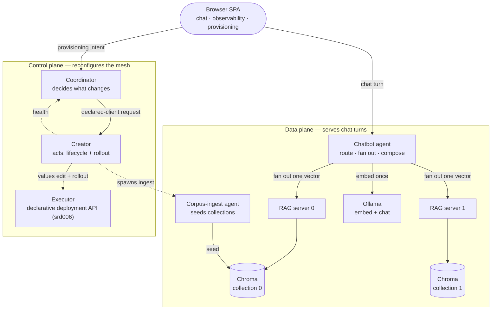
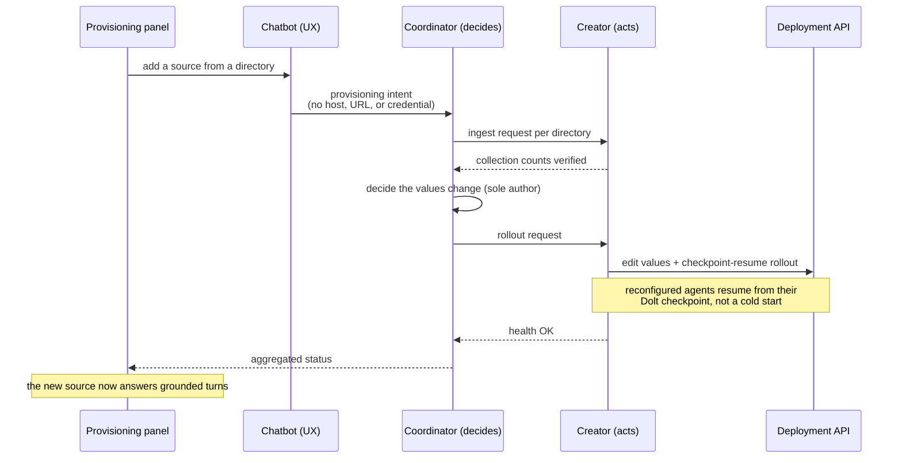
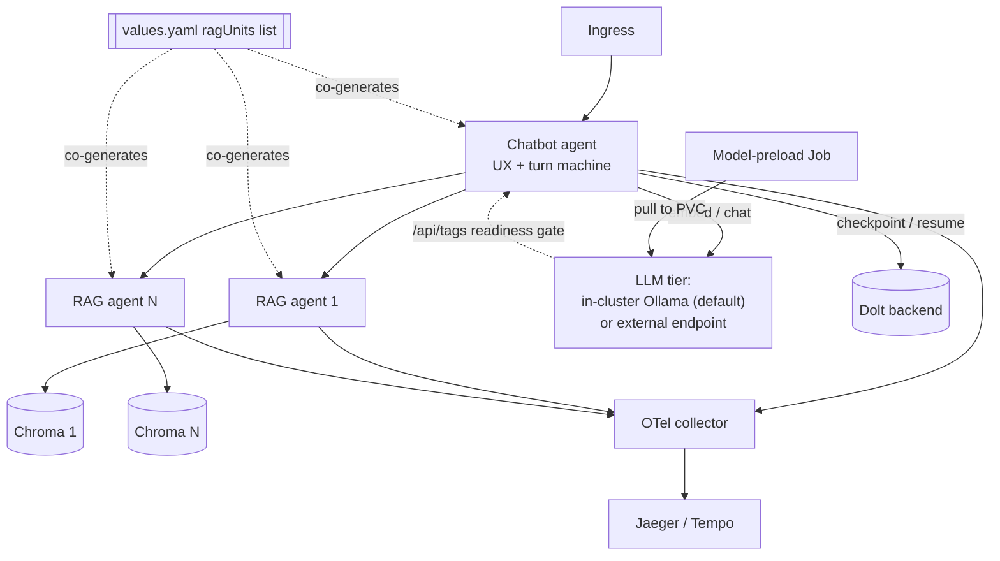

# How the chatbot mesh works

This is a reader's walkthrough of the chatbot mesh: what the parts are, how a
single question turns into a grounded answer, and how the mesh reconfigures
itself while it runs. It is the prose companion to the machine-readable
[ARCHITECTURE.yaml](ARCHITECTURE.yaml). Where a claim needs a normative source,
we link the software requirements document (SRD) rather than restate it.

The one idea to carry through: there is no bespoke orchestration code. Every
agent is a YAML profile the shared agent-core runtime loads, the way a jar runs
on a JVM. The topology, the routing, the retrieval fan-out, and the deployment
are configuration.

## Two planes

We split the mesh into a data plane that answers chat turns and a control plane
that reconfigures the mesh. The data plane serves the browser; the control plane
provisions new knowledge sources and rolls agents without stopping the service.



The governing rule in the control plane is that the coordinator decides and the
creator acts. The coordinator is the sole author of the values change; the
creator is the only agent that holds deployment-API credentials and the only one
that realizes the change. Every instance operation travels as a declared-client
request from coordinator to creator, never as a direct deployment-API call.

## The components

We list each agent and service with its home directory and its job. Retrieval-
augmented generation is abbreviated RAG; the single-page application is the SPA.

Table 1: Mesh components

| Component | Plane | Job |
|---|---|---|
| Chatbot agent (`agents/chatbot/`) | data | Run the turn: embed once, route, fan out, compose, answer; host the SPA |
| RAG server agent (`agents/rag-server/`) | data | Vector-in retrieval against one Chroma collection; one agent per corpus |
| Corpus-ingest agent (`agents/corpus-ingest/`) | data | Seed a Chroma collection from a document directory under model control |
| Coordinator (`agents/coordinator/`) | control | Decide the values change; sequence ingest and reconfiguration |
| Creator (`agents/creator/`) | control | Act: agent lifecycle, checkpoint-resume rollout; holds deployment-API authority |
| Executor (`agents/executor/`) | control | Declarative deployment API (srd006) the creator drives; validate-apply-verify-rollback binding helm/kubectl exec words |
| User interface (`ux/`) | both | The SPA with chat, observability, and provisioning panels |
| Helm chart (`helm/`) | deploy | Deploy the whole mesh as one chart from values-driven RAG pairs |

The normative detail lives in the SRDs: the RAG server in
[srd001](specs/software-requirements/srd001-rag-server-agent.yaml), the chatbot in
[srd002](specs/software-requirements/srd002-chatbot-agent.yaml), the deployment in
[srd003](specs/software-requirements/srd003-chatbot-deployment.yaml), the
coordinator in [srd004](specs/software-requirements/srd004-coordinator.yaml), the
creator in [srd005](specs/software-requirements/srd005-creator.yaml), and the
executor in [srd006](specs/software-requirements/srd006-executor.yaml).

## A single chat turn

Each turn is a request-scoped state machine run. The move that shapes everything
else is embed once, fan out: the chatbot embeds the question a single time and
sends that one vector to every selected RAG server. This is why a RAG server
accepts a vector rather than text — re-embedding per server would waste work and
risk drift between embedding spaces (srd001, srd002 R1.3).

```mermaid
sequenceDiagram
  participant B as Browser SPA
  participant CB as Chatbot agent
  participant O as Ollama (embed)
  participant RT as LLM router
  participant R0 as RAG server 0
  participant R1 as RAG server 1

  B->>CB: chat request (+ full history, stateless v1)
  CB->>O: embed the question (once)
  O-->>CB: query vector

  CB->>RT: classify the question ($tool router)
  RT-->>CB: pick a chat-LLM word<br/>(bad pick falls back to a default word)

  par fan out the same vector
    CB->>R0: query_embeddings
    R0-->>CB: chunks (+ embedding-model metadata)
  and
    CB->>R1: query_embeddings
    R1-->>CB: chunks
  end

  Note over CB: exclude a RAG whose embedding model<br/>differs from the query vector's;<br/>a failed RAG degrades to a mapped 200
  CB->>CB: compose the answer prompt<br/>via $from(label).path selectors
  CB-->>B: grounded answer (+ degradation metadata)
```

Two mechanics carry the turn. The router is one classifier LLM (large language
model) call whose response the chatbot parses through a `$tool` indirection to
select a chat-LLM word; a misparse or out-of-set pick falls back to a configured
default word rather than failing the turn (srd002 R2). Composition reaches
non-adjacent data — the original question, the routing decision, the retrieved
chunks — through command-state `$from(label).path` selectors rather than by
threading it through every intervening machine step; the `compose` builtin
renders the grounding prompt from those selectors (srd002 R1.2).

Degradation keeps a turn answerable. A per-RAG failure maps to a 200 composed
from the surviving chunks, and a RAG whose embedding model does not match the
query vector is excluded; both outcomes are noted in the response metadata
(srd002 R3). Version one is stateless: the browser sends the conversation
history each turn and there is no server-side session store (srd002 R4).

## Reconfiguring the mesh live

The control plane adds a knowledge source without downtime, following the path
intent → ingest → reconfigure → rolling restart → serve.



The transport-authority boundary holds across this flow: the user's intent never
carries a host, URL, method, or credential. Endpoints are fixed in declared REST
clients, and runtime input cannot acquire transport authority (srd002 R6, srd003
R4, srd004 R4, srd005 R5). The creator alone holds deployment-API credentials.
The rollout is checkpoint-resume — reconfigured agents resume from a Dolt
checkpoint through `--resume-checkpoint` rather than cold-starting (srd005 R3.2).

## How it deploys

One Helm chart deploys the whole mesh. The property that keeps it coherent is
values co-generation: a single `ragUnits` list renders both the RAG server
Deployments and Services and the chatbot's RAG client entries, so topology and
client configuration cannot drift (srd003 R2).



A fresh cluster answers a turn with no external dependency. The in-cluster
Ollama model tier is on by default, backed by a persistent volume, preloaded by a
Job, and readiness-gated on `/api/tags` (srd003 R6). Setting `ollama.enabled=false`
points the mesh at an external endpoint without changing the co-generation
contract. Every agent exports OpenTelemetry (OTLP) to an in-cluster collector and
on to a trace backend; cross-agent continuity rides W3C traceparent propagation,
with per-agent monitor streams as the version-one fallback (srd003 R5).

## Where to read more

The [road map](road-map.yaml) sequences the six releases from the single-RAG turn
through the control plane. The [use cases](specs/use-cases/) narrate each
release's flow with inputs and expected outputs, and the
[test suites](specs/test-suites/) validate them. For the standalone-program
framing and the extraction decisions, see the [README](../README.md).
