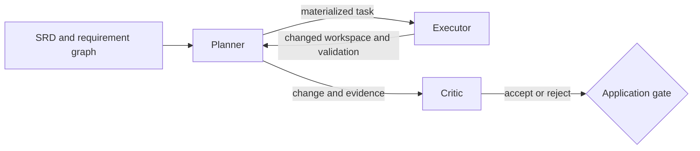

# coding-agent

A deployable planner, executor, and critic coding loop built from canonical
`agent-profiles` library agents.

## What this is

The coding agent is an application composition. A planner turns SRD context into
a task and delegates it to an executor. The executor changes an isolated
workspace and runs declared validation. A critic evaluates the produced change
and gates the final outcome.

Composition, integration fixtures, packaging, and deployment belong to this
application. The three agent families keep their canonical profiles and
requirements in `agent-profiles/`:

- `srd002-executor`
- `srd003-critic`
- `srd004-planner`

This directory owns the application reference manifest, profile-closure
packaging, live integration targets, and portable fixture in addition to the
application specification. Helm assets remain follow-up work.

## Coding loop



The integration contract has three ordered stages:

1. A live executor completes the greet task and leaves `go test ./...` green.
2. The real planner materializes that task and delegates through the real built
   agent binary to the real executor.
3. The critic evaluates the produced change and its report gates the terminal
   application state.

No stage may replace an agent boundary with `writeGeneratorChildAgent`, a shell
script, or another fake agent binary.

## Packaging and runtime boundary

`agents/application.yaml` is the only application-owned agent asset. It names
the planner, executor, critic session, and critic changed-workspace entry
profiles by paths relative to the `agent-profiles` root. It also pins the
compatible `agent-profiles/v0.*` release and records the existing configuration
surfaces; it does not copy or template library programs.

From this directory, assemble the closed runtime tree:

```bash
mage package
```

The default output is `build/profiles`; set
`CODING_AGENT_PROFILES_OUTPUT` to select another output directory and
`AGENT_PROFILES_ROOT` to package a different checkout. The resolver follows
profile-local `machine`, tool-selection, declaration, config-directory, REST,
child-profile, and nested critic references. Relative references resolve from
the YAML file that declares them; `agents/...` references resolve from the
`agent-profiles` root. The copied destination preserves those runtime paths.
Only `/opt/agent-core/...` absolute references are external. Traversal, other
absolute paths, globs in runtime references, symlinks, dangling references, and
two sources targeting one destination fail packaging.

`build/profiles/package-manifest.yaml` lists the sorted closure and provenance.
When the source checkout is exactly the compatible clean release, provenance
records that release. Otherwise it records `kind: checkout`, the checkout
revision (or `unversioned-checkout` for a fixture), and the compatible release
separately; a checkout is never mislabeled as released.

The agent-core runtime image stays profile-free. Kubernetes runs planner,
executor, and critic as separate containers using the same runtime image. Each
container mounts the packaged tree under `/profiles` and selects its own profile.
Profiles are application package content, not runtime image content.

### Parameter inventory

The coding application currently requires no generated override. Planner and
executor use their canonical `llm/default.yaml` endpoint/model declarations and
machine-local budgets. Planner's existing `execute_task.config.profile` selects
`agents/executor/profile.yaml`. Both critic modes are deterministic and have no
model, REST target, or child profile to override; their budgets remain in their
canonical machines.

These are existing profile surfaces, not a new substitution language. A later
deployment may co-generate a profile-local declaration or machine variant and
reference it from an application-owned profile, as the chatbot-mesh chart does.
This packager copies references verbatim and does not interpret placeholders.
No coding-application value is added to the library.

## Status

All three coding-loop stages and pinned, transitive profile packaging are
implemented with the production agent-core binary and canonical profiles. The
critic receives the existing Stage B workspace, writes its own accepted or
rejected verdict, and the application maps that verdict to Succeeded or Failed.
A Helm chart with one container per agent remains planned.

The existing critic benchmark/session profile remains available unchanged; the
changed-workspace mode is a separate canonical profile variant.

## Layout

```text
examples/coding-agent/
  agents/
    application.yaml
  docs/
    VISION.yaml
    ARCHITECTURE.yaml
    road-map.yaml
    SPECIFICATIONS.yaml
    specs/
      use-cases/
      test-suites/
  magefiles/
    profiles_closure.go
  testdata/integration/coding-loop/
  go.mod
  README.md
```

There is no local `specs/software-requirements/` content. Application behavior
traces to the library SRDs, so copying them here would create a second canonical
home.

## Audit

From this directory:

```bash
mage audit
```

The audit parses every YAML document, checks required fields and reciprocal
traces, assembles the application closure in a temporary tree, builds the real
agent, boot-validates all four mounted entry profiles (including
`critic/profile-workspace.yaml`), and validates formal test-evidence claims
without turning skipped live runs into passed evidence.

The integration entry points are `mage integration:executorLive`,
`mage integration:plannerDelegation`, `mage integration:criticGate`, and the
aggregate `mage integration:codingLoop`.

## Documents

- [Vision](docs/VISION.yaml)
- [Architecture](docs/ARCHITECTURE.yaml)
- [Road map](docs/road-map.yaml)
- [Specification index](docs/SPECIFICATIONS.yaml)
- [Coding-loop use case](docs/specs/use-cases/rel01.0-uc001-coding-loop.yaml)
- [Coding-loop test suite](docs/specs/test-suites/test-rel01.0-coding-loop.yaml)
