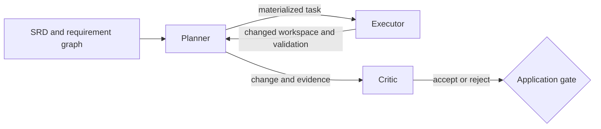

# coding-agent

A deployable planner, executor, and critic coding loop built from canonical
`agent-profiles` library agents.

## What this is

The coding agent is an application composition. A planner turns SRD context into
a task and delegates it to an executor. The executor changes an isolated
workspace and runs declared validation. A critic evaluates the produced change
and gates the final outcome.

Composition, integration fixtures, packaging, and deployment belong to this
application. The three agent families keep their canonical profiles and
requirements in `agent-profiles/`:

- `srd002-executor`
- `srd003-critic`
- `srd004-planner`

This directory owns the live integration targets and portable fixture in
addition to the application specification. Packaging and Helm assets remain
follow-up work.

## Coding loop



The integration contract has three ordered stages:

1. A live executor completes the greet task and leaves `go test ./...` green.
2. The real planner materializes that task and delegates through the real built
   agent binary to the real executor.
3. The critic evaluates the produced change and its report gates the terminal
   application state.

No stage may replace an agent boundary with `writeGeneratorChildAgent`, a shell
script, or another fake agent binary.

## Packaging and runtime boundary

The application references library agents instead of forking them. Packaging
pins an `agent-profiles/v0.*` tag and resolves the transitive closure of profiles,
declarations, tools, and configuration into a per-application profile tree.
Missing assets fail package construction.

The agent-core runtime image stays profile-free. Kubernetes runs planner,
executor, and critic as separate containers using the same runtime image. Each
container mounts the packaged tree under `/profiles` and selects its own profile.
Profiles are application package content, not runtime image content.

## Status

The live executor and real planner-delegation stages are implemented with the
production agent-core binary and canonical profiles. The critic target executes
the real critic session, real executor child, oracle, trace, and metrics
boundary. The following assets remain planned:

- a critic profile contract that accepts an existing candidate and emits an
  accept/reject application verdict;
- pinned library reference resolution and package assembly;
- a Helm chart with one container per agent.

The critic gate test case remains planned: the current canonical critic is a
benchmark runner that starts a child from a baseline sample, not a reviewer of
the Stage B workspace. The executable target reports a limited pass instead of
claiming that missing gate.

## Layout

```text
examples/coding-agent/
  docs/
    VISION.yaml
    ARCHITECTURE.yaml
    road-map.yaml
    SPECIFICATIONS.yaml
    specs/
      use-cases/
      test-suites/
  magefiles/
  testdata/integration/coding-loop/
  go.mod
  README.md
```

There is no local `specs/software-requirements/` content. Application behavior
traces to the library SRDs, so copying them here would create a second canonical
home.

## Audit

From this directory:

```bash
mage audit
```

The audit parses every YAML document, checks required fields and reciprocal
traces, builds the real agent, boot-validates the three canonical profiles, and
validates formal test-evidence claims without turning skipped live runs into
passed evidence.

The integration entry points are `mage integration:executorLive`,
`mage integration:plannerDelegation`, `mage integration:criticGate`, and the
aggregate `mage integration:codingLoop`.

## Documents

- [Vision](docs/VISION.yaml)
- [Architecture](docs/ARCHITECTURE.yaml)
- [Road map](docs/road-map.yaml)
- [Specification index](docs/SPECIFICATIONS.yaml)
- [Coding-loop use case](docs/specs/use-cases/rel01.0-uc001-coding-loop.yaml)
- [Coding-loop test suite](docs/specs/test-suites/test-rel01.0-coding-loop.yaml)
